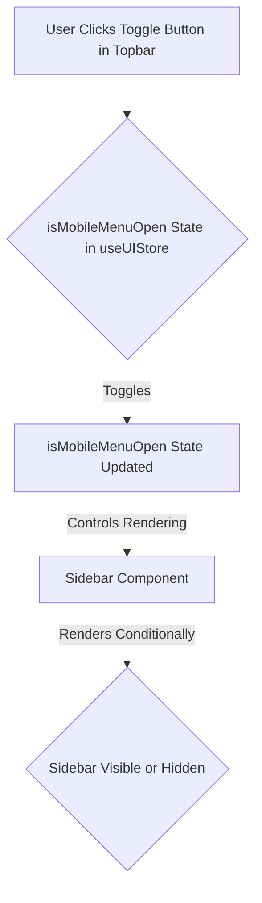

# Plan: Hide Sidebar by Default and Toggle with Topbar

## Objective:

Modify the application's UI so that the sidebar is initially hidden and is revealed by clicking a menu icon or button in the top bar.

## Analysis of Existing Components:

- Examined the code for both the [`Topbar.tsx`](my-nextjs-app/packages/ui/src/Topbar/Topbar.tsx) and [`Sidebar.tsx`](my-nextjs-app/packages/ui/src/Sidebar/Sidebar.tsx) components.
- Identified that the `useUIStore` and its `isMobileMenuOpen` state and `toggleMobileMenu` function are already used to control the mobile sidebar's visibility.

## Plan Steps:

1.  **Modify Sidebar Component:**
    *   Edit the [`Sidebar.tsx`](my-nextjs-app/packages/ui/src/Sidebar/Sidebar.tsx) file.
    *   Remove the CSS classes that currently make the desktop sidebar always visible (`hidden md:flex`).
    *   Add conditional rendering for the desktop sidebar based on the `isMobileMenuOpen` state from the `useUIStore`. This will make the sidebar's visibility on desktop also dependent on this state.
2.  **Leverage Topbar Toggle:**
    *   The [`Topbar.tsx`](my-nextjs-app/packages/ui/src/Topbar/Topbar.tsx) already contains a button that toggles the `isMobileMenuOpen` state via the `toggleMobileMenu` function.
    *   By making the desktop sidebar's visibility dependent on this state, the existing button in the top bar will control the sidebar on both mobile and desktop views.

## Flow Diagram:

## Implementation:

This plan will be implemented by switching to the 'code' mode to make the necessary code changes in the [`Sidebar.tsx`](my-nextjs-app/packages/ui/src/Sidebar/Sidebar.tsx) file.